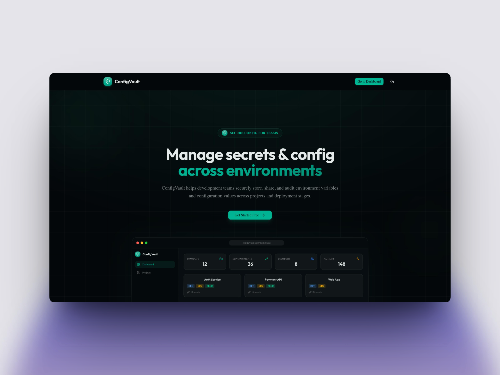

# ConfigVault

Keep your environment variables safe and synced across your team. Start a project and let Vault take care of everything else.



## Demo

[Watch the Demo](https://www.youtube.com/watch?v=T2mCSG4M2vs)

## What is ConfigVault?

ConfigVault is a full-stack configuration and secrets management platform that lets teams securely store, organize, and share environment variables across projects and environments. Every secret is encrypted at rest with AES-256-GCM. Role-based access control decides who can view, edit, reveal, or share secrets, and every action is tracked in a full audit log.

Built as a solo project for the [TestSprite Hackathon](https://www.testsprite.com/hackathon).

## Features

- **Multi-Project Management** — Organize configs across separate projects, each with its own team and environments
- **Environment Support** — Development, Staging, and Production environments created automatically with every project
- **AES-256-GCM Encryption** — Secrets are encrypted at rest; plain-text values never touch the database
- **Role-Based Access Control** — Owner, Editor, and Viewer roles with granular permissions for revealing and sharing secrets
- **Secure Secret Sharing** — Generate time-limited, view-limited share links for individual secrets, recipients don't need an account
- **Secret Rotation Tracking** — Track when secrets were last rotated so nothing goes stale
- **Bulk .env Import** — Paste a `.env` file during project creation to bootstrap an environment with config entries in one step
- **Config Duplication** — Copy entries between environments in one click
- **Duplicate Key Detection** — Surface keys that exist across multiple environments for easy sync
- **Full Audit Logging** — Every create, update, delete, reveal, share, and import is tracked with actor, timestamp, and metadata
- **Password Reset via Email** — Secure token-based password reset flow with emails delivered via Resend
- **Auth** — Cookie-based email/password authentication with login, registration, and password reset
- **Dark Mode** — System-aware theme toggle with light and dark modes

## Tech Stack

| Layer      | Tech                                                            |
| ---------- | --------------------------------------------------------------- |
| Framework  | Next.js 16 (App Router)                                        |
| Language   | TypeScript                                                      |
| Database   | PostgreSQL via Prisma 7                                         |
| Auth       | In-house cookie-based sessions (bcrypt + secure cookies)        |
| Encryption | AES-256-GCM (Node.js `crypto`)                                 |
| Email      | Resend                                                          |
| Styling    | Tailwind CSS 4, shadcn/ui, Lucide icons                        |
| Forms      | react-hook-form + Zod validation                                |

## How It Works

1. **Create a project** — optionally paste a `.env` file to bulk-import config entries on creation
2. **Add config entries** — mark sensitive values as secrets for automatic encryption
3. **Invite your team** — assign Owner, Editor, or Viewer roles with fine-grained permissions
4. **Share secrets securely** — generate time-limited, view-limited links anyone can open (no account needed)
5. **Review the audit log** — every create, update, delete, reveal, and share is tracked

## Project Structure

```
configvault/
├── src/                           # All application code
│   ├── app/
│   │   ├── (auth)/                # Login, register, forgot/reset password
│   │   ├── (dashboard)/           # Protected dashboard pages
│   │   │   ├── dashboard/         # Home overview
│   │   │   ├── projects/          # Project list, detail, settings
│   │   │   │   └── [projectId]/
│   │   │   │       ├── environments/[envId]/  # Config entry management
│   │   │   │       ├── members/               # Team member management
│   │   │   │       ├── audit-log/             # Audit log viewer
│   │   │   │       └── settings/              # Project settings
│   │   │   └── profile/           # User profile
│   │   ├── (marketing)/           # Public landing page
│   │   ├── api/                   # API routes (auth, projects, entries, share)
│   │   ├── invitations/[token]/   # Project invitation accept/decline page
│   │   └── share/[token]/         # Public share-link page
│   ├── components/
│   │   ├── audit/                 # Audit log components
│   │   ├── config/                # Config table, dialogs, badges
│   │   ├── landing/               # Marketing page components
│   │   ├── layout/                # Sidebar, theme toggle, empty states
│   │   ├── members/               # Member management & invites
│   │   ├── projects/              # Project & environment cards
│   │   └── ui/                    # shadcn/ui primitives
│   ├── hooks/                     # Custom React hooks
│   └── lib/
│       ├── auth/                  # Session management, password hashing
│       ├── audit/                 # Audit logging utilities
│       ├── db/                    # Prisma client singleton
│       ├── email/                 # Resend email integration
│       ├── permissions/           # RBAC permission checks
│       ├── security/              # AES-256-GCM encryption
│       └── validations/           # Zod schemas
├── testsprite_tests/              # AI-generated tests from TestSprite MCP
├── prisma/
│   ├── schema.prisma              # Database schema (10 models)
│   └── seed.ts                    # Seed script with sample data
├── middleware.ts                   # Route protection & auth redirects
├── README.md                      # Project documentation
```

## Testing

Test cases are generated using [TestSprite MCP](https://testsprite.com) — an AI testing agent that auto-generates comprehensive test suites. All generated tests live in the `testsprite_tests/` directory and cover API endpoint validation, RBAC permission enforcement, encryption workflows, and authentication flows.

## Local Setup

**Prerequisites:** [Node.js](https://nodejs.org/) 22+, [pnpm](https://pnpm.io/) 9+, PostgreSQL

```bash
# Clone and install
git clone <your-repo-url> configvault
cd configvault
pnpm install

# Configure environment
cp .env.example .env    # fill in your values (see below)

# Generate encryption key
node -e "console.log(require('crypto').randomBytes(32).toString('hex'))"
# Paste output as ENCRYPTION_MASTER_KEY in .env

# Push schema and seed
npx prisma db push
npx prisma db seed

# Start dev server
pnpm dev
```

Open [http://localhost:3000](http://localhost:3000)

### Seed Accounts

The seed script creates sample projects, environments, config entries, audit logs, and share links with three users:

| Name           | Email               | Role (E-Commerce) | Role (Dashboard) |
| -------------- | ------------------- | ------------------ | ---------------- |
| Alice Owner    | alice@example.com   | Owner              | Owner            |
| Bob Editor     | bob@example.com     | Editor             | Editor           |
| Charlie Viewer | charlie@example.com | Viewer             | —                |

Register through the app with the same emails, then update Profile IDs to match, or update the UUIDs in `prisma/seed.ts` before seeding.

### Environment Variables

```
DATABASE_URL=                # PostgreSQL connection string
ENCRYPTION_MASTER_KEY=       # 32-byte hex key (see setup step above)
RESEND_API_KEY=              # Resend API key for password reset emails
NEXT_PUBLIC_APP_URL=         # App base URL (e.g. http://localhost:3000)
```

### Scripts

| Command                | Description                       |
| ---------------------- | --------------------------------- |
| `pnpm dev`             | Start development server          |
| `pnpm build`           | Build for production              |
| `pnpm start`           | Start production server           |
| `pnpm lint`            | Run ESLint                        |
| `npx prisma db push`   | Push schema to database           |
| `npx prisma db seed`   | Run the seed script               |
| `npx prisma studio`    | Open Prisma Studio (database GUI) |
| `npx prisma generate`  | Regenerate Prisma Client          |

## License

MIT
